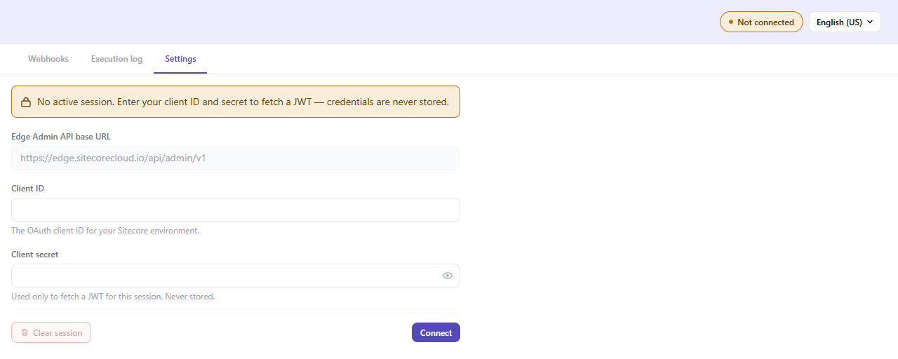
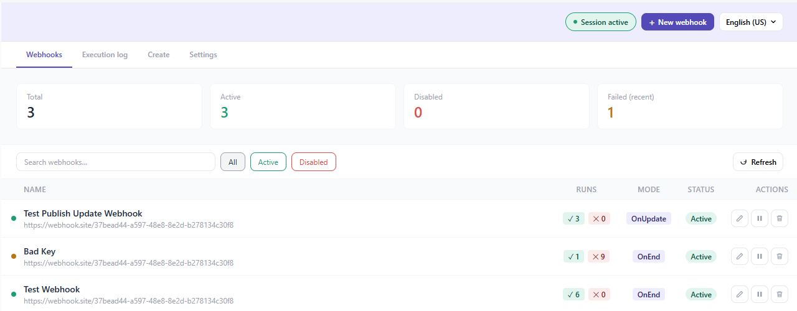
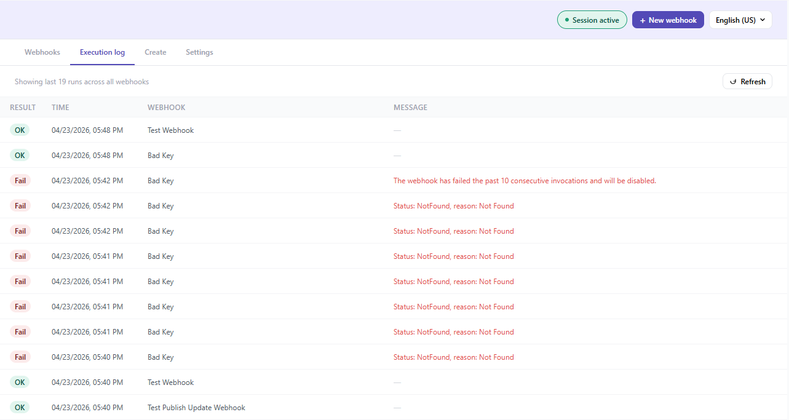

# Experience Edge Webhook Admin

A browser-based admin tool for managing **Experience Edge webhooks** on SitecoreAI. Built as a [Sitecore Marketplace](https://marketplace.sitecore.com/) dashboard widget using Next.js 16 and the Marketplace SDK.

---

## Table of contents

- [Overview](#overview)
- [Getting started](#getting-started)
- [Connecting to your environment](#connecting-to-your-environment)
- [Managing webhooks](#managing-webhooks)
  - [Webhooks tab](#webhooks-tab)
  - [Creating a webhook](#creating-a-webhook)
  - [Editing a webhook](#editing-a-webhook)
  - [Enabling and disabling](#enabling-and-disabling)
  - [Deleting a webhook](#deleting-a-webhook)
- [Execution log](#execution-log)
- [Filtering and search](#filtering-and-search)
- [Internationalization](#internationalization)
- [Security model](#security-model)
- [Architecture](#architecture)
- [Development setup](#development-setup)

---

## Overview

The Webhook Admin widget gives SitecoreAI teams a single place to:

| Capability | Detail |
|---|---|
| **View** all webhooks for your tenant | Status, execution mode, recent run history |
| **Create** new webhooks | Full form with validation — name, URI, method, body, custom headers |
| **Edit** webhooks inline | Expand any row to update without leaving the list |
| **Enable / Disable** webhooks | Confirmation dialog before making changes |
| **Delete** webhooks | Irreversible action guarded by a confirmation dialog |
| **Browse execution history** | Cross-webhook log sorted newest-first, up to 50 entries |
| **Filter and search** | Filter by Active / Disabled, search by name or URI |

The widget connects directly to the [Edge Admin API](https://doc.sitecore.com/sai/en/developers/sitecoreai/sitecore-experience-manager/webhook-objects.html) using a short-lived JWT that is fetched from Sitecore's OAuth endpoint at connect time and stored only in `sessionStorage` for the duration of the browser tab.

---

## Getting started

### Prerequisites

- Node.js 18 or later
- A SitecoreAI environment with Edge Admin API access
- A Sitecore OAuth **Client ID** and **Client secret** with permission to manage webhooks


---

## Connecting to your environment

Before you can manage webhooks, you must establish a session. Click the **Settings** tab or the session status pill in the top-right corner.

### Settings panel

| Field | Description |
|---|---|
| **Edge Admin API base URL** | Pre-filled — `https://edge.sitecorecloud.io/api/admin/v1`. Read-only. |
| **Client ID** | Your Sitecore OAuth client ID. |
| **Client Secret** | Your OAuth client secret. Hidden by default; click the eye icon to reveal. |

Click **Connect** to exchange your credentials for a short-lived JWT. The credentials are discarded immediately after the token is received — only the JWT is retained (in `sessionStorage`).



Once connected:
- The status pill in the header turns **green** (Session active)
- The **Webhooks** tab loads your webhook list automatically
- The **Create** tab and **+ New webhook** button become available

To end your session manually, click **Clear session**. The JWT is also cleared automatically when the browser tab is closed.

---

## Managing webhooks

### Webhooks tab

The main view lists all webhooks for your tenant with at-a-glance status information.



**Status dot colours**

| Colour | Meaning |
|---|---|
| Green | Active, no recent failures |
| Amber | Active, but at least one recent run failed |
| Red | Disabled |

**Run counts**

Click the `✓ / ✕` count badges on any row to expand an inline panel showing the timestamp, result, and error message (if any) for each recent run.

**Summary cards**

The four cards at the top always reflect the full unfiltered list, so your overall health is visible regardless of any active search or filter.

---

### Creating a webhook

1. Click **+ New webhook** (top-right) or the **Create** tab.  
2. Fill in the form fields:

| Field | Required | Notes |
|---|---|---|
| **Name** | Yes | Human-readable label for the webhook |
| **URI** | Yes | Must be a valid `https://` URL |
| **HTTP Method** | Yes | `POST` (default) or `GET` |
| **Execution mode** | Yes | See table below |
| **Body** | No | JSON payload sent with `OnEnd` requests |
| **Body include** | No | JSON filter applied to `OnUpdate` payloads — must be valid JSON |
| **Custom headers** | No | Add any number of `key: value` header pairs |
| **Created by** | Auto | Populated from your Sitecore user account — read-only |

**Execution modes**

| Mode | When it fires | Body field |
|---|---|---|
| `OnEnd` | After a publishing job finishes | **Body** — static JSON payload sent with every call |
| `OnUpdate` | When specific content entities are updated | **Body include** — JSON filter that narrows which updates trigger the call |

3. Click **Create webhook**. You are returned to the Webhooks list automatically.

---

### Editing a webhook

Click the **pencil icon** on any webhook row. An inline form expands below the row — all fields are editable in place. Click **Save changes** to apply, or **Cancel** to discard.

Only one webhook can be expanded for editing at a time. Opening a second row collapses the previous one.

---

### Enabling and disabling

Click the **pause icon** (active webhooks) or **play icon** (disabled webhooks) to toggle state. A confirmation dialog appears before any change is made.


---

### Deleting a webhook

Click the **trash icon** on any row. A confirmation dialog warns that the action cannot be undone. Confirm to permanently delete the webhook.

---

## Execution log

The **Execution log** tab provides a unified, chronological view of recent runs across **all** webhooks — useful for diagnosing failures without opening each webhook individually.




- Entries are sorted **newest first**.
- A maximum of **50 entries** are shown (limited to the `lastRuns` data returned by the API).
- Click **Refresh** to re-fetch webhook data and update the log.

---

## Filtering and search

The Webhooks tab toolbar provides three ways to narrow the list:

| Control | Behaviour |
|---|---|
| **Search box** | Filters by webhook name **or** URI as you type |
| **All** button | Clears any status filter (shows all webhooks) |
| **Active** button | Shows only webhooks where `disabled = false` |
| **Disabled** button | Shows only webhooks where `disabled = true` |

Search and status filter work together — e.g. searching for `cdn` while the **Active** filter is selected shows only active webhooks whose name or URI contains "cdn".

The summary stat cards at the top always reflect the **full unfiltered count**, not the filtered view.

---

## Internationalization

The UI is fully translated into 11 languages. Switch language using the **language switcher** in the top-right corner of the header. The selected language persists for the session.

| Code | Language |
|---|---|
| `en-US` | English (US) — default |
| `en` | English (UK) |
| `zh` | Chinese (Simplified) |
| `es` | Spanish |
| `hi` | Hindi |
| `ar` | Arabic |
| `fr` | French |
| `pt` | Portuguese |
| `bn` | Bengali |
| `ru` | Russian |
| `ja` | Japanese |

---

## Security model

| Aspect | Behaviour |
|---|---|
| **Credentials** | Client ID and secret are held only in React component state and are explicitly cleared from memory immediately after the JWT is fetched — they are **never written to storage**. |
| **JWT storage** | Stored in `sessionStorage` under prefixed keys (`sc_wh_url`, `sc_wh_token`). Cleared automatically when the browser tab is closed. |
| **Server-side token fetch** | The OAuth token request is proxied through a Next.js API route (`/api/token`) to avoid CORS errors. Credentials are forwarded to `auth.sitecorecloud.io` server-side and the response token is returned to the browser — the server does not log or store them. |
| **No localStorage** | Nothing is ever written to `localStorage` or cookies. |
| **XSS caveat** | While a session is active, the JWT in `sessionStorage` is accessible to any JavaScript running on the same origin. Avoid running untrusted third-party scripts alongside this tool. |
| **Created by** | Resolved from `host.user` via the Marketplace SDK — held in React state only, never persisted. |

---

## Architecture

```
src/
├── app/
│   ├── api/
│   │   └── token/
│   │       └── route.ts          ← Server-side OAuth proxy (avoids CORS)
│   ├── page.tsx                  ← Root page: tab state, fetch logic, filter state
│   └── layout.tsx
├── components/
│   └── webhooks/
│       ├── WebhookList.tsx       ← List rows, inline edit, enable/disable/delete dialogs
│       ├── WebhookForm.tsx       ← Shared create / edit form with validation
│       ├── ExecutionLog.tsx      ← Cross-webhook run history table
│       └── SettingsPanel.tsx     ← OAuth connect / disconnect UI
├── context/
│   └── LanguageContext.tsx       ← i18n provider + language switcher state
├── hooks/
│   └── useMarketplaceClient.ts   ← Marketplace SDK init + host.user resolution
├── lib/
│   ├── api.ts                    ← Edge Admin API calls (list, create, update, delete)
│   ├── i18n.ts                   ← Translation strings for 11 languages
│   └── session.ts                ← sessionStorage read/write/clear helpers
└── types/
    └── webhook.ts                ← Types mirroring the Edge Admin API objects exactly
```

### Data flow

```
Browser
  │
  ├── Settings tab
  │     └── POST /api/token  →  Next.js route  →  auth.sitecorecloud.io
  │                                                 returns { access_token }
  │                              JWT saved to sessionStorage
  │
  └── Webhooks / Log tab
        └── fetch() with Bearer header  →  edge.sitecorecloud.io/api/admin/v1/webhooks
```

---

## Development setup

### Environment

No `.env` file is required. The API base URL and OAuth endpoint are hardcoded constants — both are public, non-secret values.

### Commands

```bash
npm install        # Install dependencies
npm run dev        # Start Next.js dev server (http://localhost:3000)
npm run build      # Production build
```

### Adding a translation

1. Open [src/lib/i18n.ts](src/lib/i18n.ts).
2. Add the new language code to the `Lang` union and `LANGUAGES` array.
3. Add a new translation block implementing the full `Translations` interface.
4. The language switcher will pick it up automatically.

### Webhook object reference

See the [Sitecore documentation](https://doc.sitecore.com/sai/en/developers/sitecoreai/sitecore-experience-manager/webhook-objects.html) for the full shape of `WebhookEdit`, `Webhook`, `EntityUpdate`, and `WebHookRequest`. All types in [src/types/webhook.ts](src/types/webhook.ts) mirror the API exactly.
